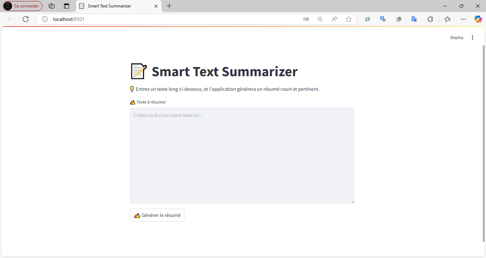
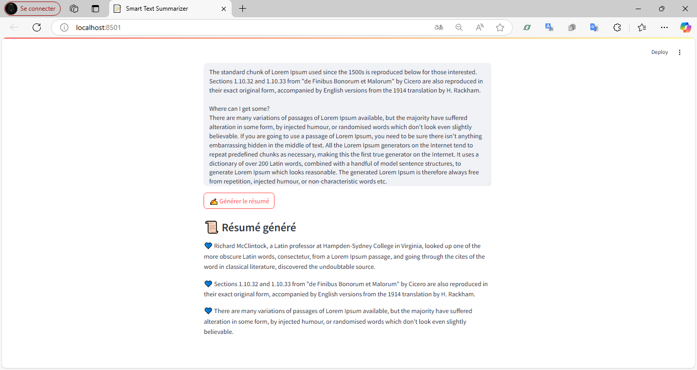

# Text Summarizer - Application de Résumé Automatique de Texte

Résumé automatique des textes longs avec **Streamlit**, **spaCy** et **TF-IDF**.

## Fonctionnalités
- Résumé automatique de textes longs
- Interface simple et interactive avec **Streamlit**
- Traitement rapide et efficace

## Technologies
- **Python**, **Streamlit**
- **spaCy**, **scikit-learn**
- **Git LFS** pour les fichiers volumineux

## Captures d'écran
<div align="center">
  
</div>
<div align="center">
  
</div>

## Installation
```bash
git clone https://github.com/Kawsouiyah/text_summarizer.git
pip install -r requirements.txt
python -m spacy download en_core_web_sm
streamlit run app.py
